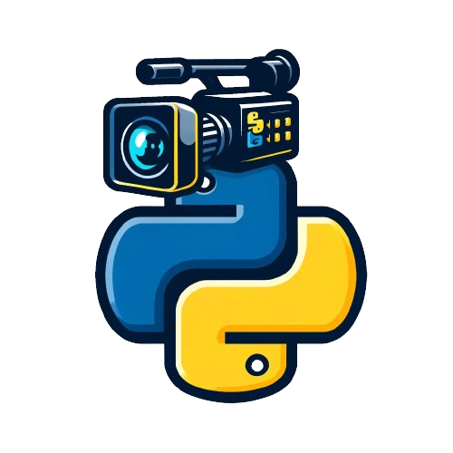

# SyntheticVideoGeneration

This project has been inspired by the synthetic frame generation process provided by the [iros20-6d-pose-tracking](https://github.com/wenbowen123/iros20-6d-pose-tracking) project. This repository allows you to generate synthetic videos from your CAD models. For each frame in each video sequence, will be generated also a `meta.npy` containing additional informations, such as ground-truth 6DoF of each object in the frame, bounding boxes of those objects and much other information specified in the dedicated section. file The models are dynamically loaded into a Blender scene, and through a keyframe generation process, the camera moves along spherical points smoothly to create the final video. The whole project is designed to work with YCB-Video datasets like, follow the installation steps below to use it. We also provide scripts for creating YOLO-compatible datasets.

<p align="center">
    
</p>

The project has been tested on both Linux (Ubuntu 22.04) and Windows.

## Future Roadmap 🔜
- [ ] Check why multithreading in `generate_bboxes.py` is slower than running a single thread. 
- [ ] Fix `visualize_video.py` that doesn't work with boxes that are outside of the image. 
- [ ] Fix YoloDatasetV2 training and testing folders.

## Installation 🚀
We recomend the use of Anaconda (or Miniconda) to run the project since we used Python 3.10.

### Linux 🐧
If you are using a Linux system you can simply run:

```
bash install.sh
```

The system will prompt you with some questions about files to be downloaded (`download_heavy_files.py`). To run the system you have to download at least one of the two `.blend` files (`1.blend` contains YCB-Video used to generate noise in the video, while `2.blend` is an empty scene) and the Blender version. The system will download all the files and delete the temporal files so do not delete anything manually! After this step a new folder `Blender-279b` will be created.

### Windows
As we claimed, our project is fully compatible with Windows, however, unlike Linux you have to perform some manual steps to install the needed components:

```
# Create the conda env and install the requirements
conda create --prefix=./venv python=3.10

conda activate ./venv

pip install -r requirements.txt

# Download files from the server
python Code/Scripts/download_heavy_files.py 

conda env config vars set BLENDER_PATH="/absolute/path/SyntheticVideoGeneration/Blender-2.79b/blender.exe"

# Restart the env to refresh the env vars
conda deactivate
```

After running the 

```
python Code/Scripts/download_heavy_files.py
```

You will be prompted with some questions. Please, refer to the Linux installation part for the instructions on what to do.

## How to run the project using your own dataset 🗂️
In order to use the project with your dataset, you have to arrange the files such that they can be processed correctly by the scripts. We used the YCB-Dataset format as the system is designed to work with it and with similar custom datasets. 

1. Create a folder `Data/Datasets/`.
2. Inside `Data/Datasets/` create the folder `MyDataset/` (you can call it as you want).
3. Create a folder `MyDataset/Models/` and put here all the CAD model files (only .obj files are accepted, if your files are in a different format you can import them in Blender and export them as .obj)
4. Set the `dataset_name` in the `scene_generation.yml` file. The value of this variable must be the name of the folder of your dataset (in this example `MyDataset`).
5. Run the following command to generate the `models_id.yml` file:

```
python Code/Scripts/generate_models_id.py
```

The final structure of your custom dataset should be the following:

```
📁 Data/Datasets/MyDataset/
|
├── 📄 models_id.yml
|
└── 📁 Models/
    |
    ├── 📁 ModelName1/
    |   └── 📄 ModelName1.obj
    |
    ├── 📁 ModelName2/
    |   └── 📄 ModelName2.obj
    |
    ├── 📁 ModelName3/
    |   └── 📄 ModelName3.obj
    |
    └── ...

```

## Run the project 🖥️
You can run the project by running the script:

```
python Code/main.py
```

or by running manually the following scripts (NB: Steps 4 and 5 are not run by `main.py`, therefore if you want the videos or generate the YCB additional files (`points.xyz` and `classes.txt` files) you have to run them manually):

### 1. Generate the video sequences

```
python Code/SceneGeneration/generate_scenes.py
```

This script will generate a new directory `Data/Datasets/MyDataset/GeneratedScenes/`. Then for each blender file specified in `scene_generation.yml`, the script will generated a number of scenes (video sequences) based on the number specified in the same config file as well. Each video sequence is identified by a 4 digit number (starting from 0000/). The script will generate 4 files for each frame:
 - `xxxx-color.png`: RBG Frame.
 - `xxxx-depth.png`: Depth map of the frame.
 - `xxxx-seg.png`: Segmentation map with the all you models segmented.
 - `xxxx-meta.npy`: Numpy file containing:
    1. `cls_indexes`: IDs of the objects in the scene (the models are picked randomly), the IDs are those specified in the `models_id.yml` file.
    2. `poses`: 4x4 matrix specifying the 6DoF pose of the objects ($i$-th matrix corresponds to the 6Dposes of the $i$-th model in `cls_indexes`).
    3. `blendercam_in_world`: 4x4 matrix specifying the 6DoF pose of the camera.
    4. `intrinsic_matrix`: Matrix specifying the camera intrinsic parameters.

**NB**: The `poses` for each object will be always the same as the objects are not moving in the scene. To obtain the poses relative to the camera (therefore considering the camera static and the world is moving) you can combine the `blendercam_in_world` with the `poses`.

### 2. Generate bounding boxes

```
python Code/SceneGeneration/generate_bboxes.py
```

This script will loop over the generated sequences to generate the following files:

- `xxxx-box-2d.txt`: Ground truth 2D bounding boxes for the objects in the `xxxx` frame.
- `xxxx-box-3d.txt`: Ground truth 3D bounding boxes for the objects in the `xxxx` frame. Each row is composed by the name of the model and the 3D coordinates of each vertex of the bounding box. **NB**: These coordinates are relative to the world coordinates, therefore the coordinates of an object 3D bounding box don't change over the time (frames).
- `xxxx-box-3d-proj.txt`: Ground truth 3D bounding boxes projected into the camera. Each row is composed by the name of the model and the 3D coordinates of each vertex of the bounding box.

Addiotionally, the script removes from the `xxxx-meta.npy` file the objects (and the associated inforations) that are not visible in the frame. 

### 3. Convert bounding boxes in a YOLO format
```
python Code/SceneGeneration/yolo_conversion.py
```

This scripts converts the `xxxx-box.txt` files in a YOLO like format (therefore all the box will not exceed the image). This script is part of the project since this repository is also part of a bigger project in which YOLOv8 is used to perform object detection tasks. The generated `YoloDataset/` will be organized as follows:

```
📁 Data/Datasets/YoloDatasetV2/
|
├── 📁 train/
|   ├── 📁 images/
|   |   ├── 0000-000001.png
|   |   ...
|   |   └── xxxx-xxxxxx.png
|   └── 📁 labels/
|       ├── 0002-000001.txt
|       ...
|       └── xxxx-xxxxxx.txt
|
└── 📁 test/
    ├── 📁 images/
    |   ├── 0002-000001.png
    |   ...
    |   └── yyyy-yyyyyy.png
    |
    └── 📁 labels/
        ├── 0002-000001.txt
        ...
        └── yyyy-yyyyyy.txt
...

```

We also provide a second version of the yolo conversion script:

```
python Code/SceneGeneration/yolo_conversion_v2.py
```

This script will still generate a Yolo-compatible dataset but the directory structure is slightly diffent:

```
📁 Data/Datasets/YoloDataset/
|
├── 📁 images/
|   ├── 📁 train/
|   |   ├── 0000-000001.txt
|   |   ...
|   |   └── xxxx-xxxxxx.txt
|   └── 📁 val/
|       ├── 0002-000001.txt
|       ...
|       └── yyyy-yyyyyy.txt
|
└── 📁 labels/
    ├── 📁 train/
    |   ├── 0000-000001.txt
    |   ...
    |   └── xxxx-xxxxxx.txt
    |
    └── 📁 val/
        ├── 0002-000001.txt
        ...
        └── yyyy-yyyyyy.txt
...

```

### 4. Convert the GeneratedScenes in BOP format

```
python Code/SceneGeneration/ycb_conversion_v2.py
```

This script converts the `GeneratedScenes/` in a new dataset that is compatible with [BOP challenge](https://bop.felk.cvut.cz/), therefore the structure of the dataset will be as follows:

```
📁 Data/Datasets/MyDataset/GeneratedScenesBop/
|
├── 📁 0000/
|   ├── 📁 rgb/
|   ├── 📁 depth/
|   ├── 📁 mask/
|   
|
├──  📁 0001/
|
└──  📁 0002/
...

```

### 5. YCB Additional files generation (Optional)
```
python Code/Scripts/generate_ycb_addional_files.py
```

This script is used for generating YCB-like additional files: 
- `points.xyz`: For each model the script will generate this file containing the vertices of the 3D model's mesh.
- `files_list.txt`: File containing the list of all the images in the dataset.
- `models_info.json`: JSON file containing:
    - `diameter`: Diameter of the object.
    - `min_x`
    - `min_y`
    - `min_z`
    - `max_x`
    - `max_y`
    - `max_z`
    - `com`: Center of Mass of the object.


### 6. Video creation (Optional)
```
python Code/Scripts/visualize_video.py
```
This script is used for putting toghether all the frames of each sequence to create the video.

## Why Blender-2.79b?
We are aware that this Blender version is quite outdated; however, most projects involving synthetic data generation still use this version. As far as we know, starting from Blender 2.80, Python scripting APIs are completely changed, making them more complicated, even for simpler tasks such as the one performed by this project.

### Why should I download Blender using your script?
The Blender version we have provided in the installation script is read-to-go for the project. If you legitimatelly don't trust our files, you can freely download Blender-2.79b from the [official website](https://download.blender.org/release/Blender2.79/) and install the pip packages needed to run the project.
